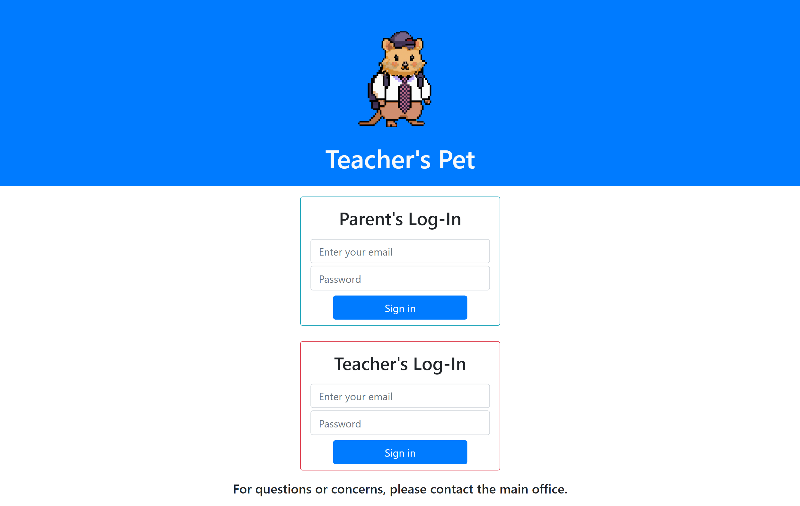

<div id="top"></div>

<!-- TABLE OF CONTENTS -->
<details>
  <summary>Table of Contents</summary>
  <ol>
    <li><a href="#descriptiont">Description</a></li>
    <li><a href="#link-to-the-app">Link to the App</a></li>
    <li><a href="#user-story">User Story</a></li>
    <li><a href="#installation">Installation</a></li>
    <li><a href="#usage">Usage</a></li>
    <li><a href="#future-development">Future Development</a></li>
    <li><a href="#collaborators">Collaborators</a></li>
  </ol>
</details>

# Teacher's Pet


## Description

 "Image of the Teacher's Pet Mascot QuokkaCola") 

A classroom helper application that allows parents to submit important student information to their teacher. 
* This information includes details like allergies, medications, diet, etc.After being submitted, a student's information can be retrieved and updated by their parent at any time as it is stored in a SQL database. 
* Additionally, the teacher can post messages to a messageboard which can be viewed by parents. 
* This project uses Node.js & Express.js to create RESTful API's, Handlebars.js as the template engine, MYSQL and Sequelize ORM for the database, and features GET and POST routes for retrieving and adding in new data. 

<p align="right">(<a href="#top">back to top</a>)</p>


## Link to the App

* ['Teachers Pet'](https://github.com/jffsun/teachers-pet)
* ['Teachers Pet Heroku Live](https://aqueous-wildwood-21593.herokuapp.com/)



<p align="right">(<a href="#top">back to top</a>)</p>


## User Story
As a user who is the teacher, I am required to first login so I can verify that I am the teacher. After my credentials are verified, I can quickly view all my student's information in a table.


As a user who is a parent, I am required to enter my credentials so I can verify I am a student's parent. I can submit  important information specific to my child to their teacher and I can update this card at any time.


Parent User Cards


Teacher User Cards


<p align="right">(<a href="#top">back to top</a>)</p>


## Installation

1. Clone the repo
   ```sh
   git clone https://github.com/jffsun/teachers-pet
2. Check your .env file!
   ```sh
   Make sure to add .env file to the root folder.
   ```
3. Run the schema.sql from your mySQL shell.
   ```sh
   source db/schema.sql;
   quit;
   ```
4. Run the seeds and install your Node packages!
   ```sh
   Navigate to the root folder of this repo on your Command Prompt or Terminal and type:
   node seeds/index.js
   npm i
5. If you want to deploy this application on your local server,
   ```sh
   npm start 
   or, to have a nicer experience,
   npx nodemon
*  Note: The account email and password are pre-seeded. Head on over to the Parents or Teacher seeds in the seeds folder to log in.

<p align="right">(<a href="#top">back to top</a>)</p>

## Usage

If you want to try using the deployed website follow these instructions below!

1. Head over to the deployed website on Heroku!
   ```sh
   https://aqueous-wildwood-21593.herokuapp.com/
   ```
2. Try logging in with one of our user log-ins from the parents seeds!
   ```sh
  Here is an example:
  Email: michael.scott@gmail.com
  Password: michael123
   ```

<p align="right">(<a href="#top">back to top</a>)</p>

## Future Development
Adding Teacher capable to register new students (if a new student came in the middle of the year)
Adding a way for teachers and parents to message with each other
Scaling the application to go from one classroom to multiple classrooms 
Scaling the application from one teacher to multiple teachers 

<p align="right">(<a href="#top">back to top</a>)</p>

## Collaborators
[Andrew Choi](https://github.com/WhaleAnchor)
[Jeffrey Sun](https://github.com/jffsun)
[Jeffrey Tran](https://github.com/Jtran028)
[Kevin Ng](https://github.com/KevinNg2)

<p align="right">(<a href="#top">back to top</a>)</p>